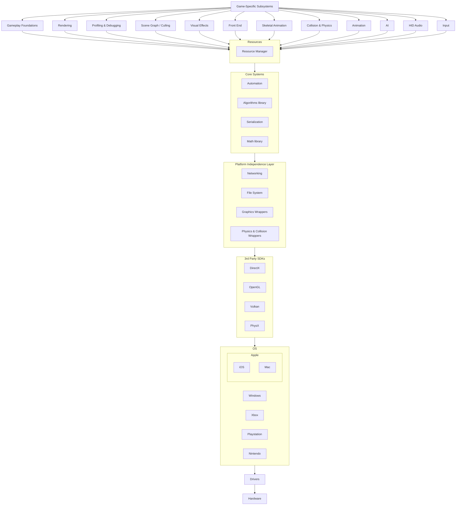

## Preface

There are not many resources for a deep dive into Epic Game's Unreal Engine architecture beyond stepping through the
source code or reading the little information provided in the official documentation.
This should help fill in the gaps for those who are interested in learning more about the engine.

## History

It is important to start off with the context and history of Unreal Engine. Tim Sweeney took significant inspiration from Quake 1 (1996) and Quake 2 (1997) before he released Unreal (1998). Thus, most of the foundational architecture for Unreal Engine is very similar to Quake. In fact, this quote sums it up

> "This is probably going to come out sounding demeaning, but Epic wants Unreal to be Quake. Everything they did with Unreal, they did because they wanted it to be like what Quake turned out to be." - [John Carmack, creator of Quake, id Software](http://advsys.net/ken/carmken.htm) 

**Unreal shipped as a first person shooter game.** This is important. All the networking, rendering, and the rest of the architecture was developed with an FPS game in mind. Although it did a much better job than Quake in adding in flexibility for other genres (e.g. Quake rendering favored dark-lit corridor gameplay), and although Epic Games will market Unreal Engine as supporting all genres, it is a fact that Unreal Engine was originally and currently still is optimized for first person shooters and genres similar to it. Take client-side prediction for example, or its decision for UDP networking. These are optimizations that greatly improve the experience of FPS and TPS games, but not nearly as much for RTS or TBS games (TCP networking is perfect for Turn Based Strategy).

Hence, Quake influencing Unreal makes the [Quake source code and architecture](https://github.com/id-Software/Quake-2) a great resource for learning the fundamental foundations of Unreal Engine.

## Two Parts

Unreal Engine can be broken into two important components: the Editor and the Runtime Engine. The Editor is the suite of tools used to create and edit content for the game. The Runtime Engine is the part that runs the game.

Unlike most other game engines, Unreal Engine and Quake Engine has the tool suite (`UnrealEd`) built directly into the runtime engine. There are a lot of benefits for this architectural decision, most importantly that the game can run via PIE (Play in Editor) without performance impacts. This also allows loading asset contents and seeing them in their full glory. Furthermore, this reduces code duplication between the two since the Editor is directly using the runtime code. There are drawbacks however, such as in developer productivity due to the locking of files preventing simultaneous editing of assets. More on this later.

# Runtime Engine Architecture

Unreal Engine, like all software systems and game engines, is built in layers. Generally, the lower layers do not depend on the upper layers. This prevents circular dependencies and provides modularity that allows for cross-platform support. One of the biggest benefits is that this makes the code more testable.

The upper-most layers contain the well-known `GameFramework` classes containing `PlayerController` and
`GameModeBase`. The lower layers contain platform-specific implementations such as `Runtime/Unix`.

From top to bottom, the layers are:

* Game-Specific Subsystems
* Gameplay Foundations, Rendering, Profiling & Debugging, Scene Graph / Culling, Visual Effects, Front End, Skeletal
  Animation Collision & Physics, Animation, AI, HID Audio, Input
* Resources (Resource Manager)
* Core Systems
* Platform Independence Layer (Networking, File System)
* 3rd Party SDKs (DirectX, OpenGL, PhysX)
* OS
* Drivers
* Hardware


    


To keep the project modular, many features within these layers (e.g. Replication Graph, Gameplay Ability System) are
separated out into optional Plugins.

## Target Hardware Layer

This layer is platform-specific. Generally, Unreal Engine is platform-agnostic, but there are some platform-specific
code and optimizations for different computer or console systems.
The Quake 2 engine, for example, had
significant [optimizations made for the Intel's Pentium processor and its pre-fetching cache](https://fabiensanglard.net/quake2/quake2_software_renderer.php)
due to their popularity at the time.

### Apple

### Xbox

### Playstation

### Nintendo

### Mobile

### Web

### VR

## Drivers Layer

Drivers manage hardware resources and provide an interface (abstraction) for the operating system to interact with the
myriad variants of hardware devices.

## Operating System Layer

This part of Unreal Engine handles the various operating systems which share hardware resources between multiple
applications, one being your game. Unlike consoles of old
where a game could "own" the entire device and assume full control of memory
and compute resources, modern consoles and modern operating systems employ preemptive multitasking and can have multiple applications
running alongside your game (e.g. Xbox Live, Netflix, Voice Chat, store downloads) that take over certain system resources or
pause the game entirely (Xbox Dashboard). At that time, a layer like this was nonexistent or at most limited to a
library that directly access hardware resources.

Some reasons why this layer exists:

* Implement memory access and tracking for each platform.
* Obtain platform properties regarding features that are supported (e.g. Texture Streaming, High Quality Light Maps,
  Audio Streaming)
* Access (and wrap functions for) platform native APIs (e.g. Atomics, File I/O, Time)
* Execute general platform commands (e.g. get orientation of screen, get network type)
* Provide platform-specific implementations of OS functions (e.g. `FPlatformProcess::Sleep`
  , `FPlatformProcess::LaunchURL`)

`FGenericPlatformMisc` and `FGenericPlatform` are examples of OS layer classes.

### Windows

#### The Window

The engine starts with a window. The operating system provides the fundamental functionality, such as the APIs (e.g. Windows API) and the graphical subsystem
for creating and managing a windows. The graphical subsystem refers to a stack of software and hardware components responsible for rendering the graphics on
your screen. The window manager handles the drawing, positioning, resizing, and user interactions with the window. The Graphics Device Interface (GDI) is what creates
the graphical content by communicating with the graphics drivers by sending commands. The graphics drivers translate the commands from the GDI into instructions
the graphics hardware can understand. And finally, the the graphics hardware is the physical component that renders the graphics on the screen by creating a
frame buffer, applying algorithms to each pixel on the frame buffer, and display the final image.

#### Entry Point

The entry point for the engine depends on the platform. Every Windows program has an entry-point function
called `WinMain`.
Unreal Engine's entry point for Windows, like all other game engines, is the `WinMain` function defined
in `Windows/LaunchWindows.cpp`.
The [Quake 2 engine](https://github.com/id-Software/Quake-2/blob/master/win32/sys_win.c#L594), for example, also has the
identically named function.

Each supported platform has their respective entry point:

* MacOS: `INT32_MAIN_INT32_ARGC_TCHAR_ARGV` in `Mac/LaunchMac.cpp`
* Linux: `int main` in `Linux/LaunchLinux.cpp`
* IOS: `int main` in `IOS/LaunchIOS.cpp`

```c++
// Launch/Private/Windows/LaunchWindows.cpp

// Windows specific parameters: HINSTANCE is identification to prevent class name clashing
int32 WINAPI WinMain(_In_ HINSTANCE hInInstance, _In_opt_ HINSTANCE hPrevInstance, _In_ char* pCmdLine, _In_ int32 nCmdShow)
{
	int32 Result = LaunchWindowsStartup(hInInstance, hPrevInstance, pCmdLine, nCmdShow, nullptr); // Launch Unreal Engine
	LaunchWindowsShutdown(); 
	return Result; // 0 on success, error level otherwise
}
```

#### Main Engine Loop

It is a very simple while loop.

```c++
// Runtime/Launch/Private/Launch.cpp

while( !IsEngineExitRequested() )
{
    EngineTick();
}
```

#### Table of Files


| File                    | Description                                                                                                                                                                                          |
|-------------------------|------------------------------------------------------------------------------------------------------------------------------------------------------------------------------------------------------|
| WindowsPlatform.h       | Abstracts away Windows platform-specific details (compiler, sdk versions, etc.) and provides a consistent interface for the rest of the code base. Specifically defines types, settings, and macros. |


### MacOS & iOS

Unreal Engine interfaces with Apple platforms in `Runtime/Core/Apple` with the help of Apple's Core Foundation (CF) SDK.
Core
Foundation is an API for C used for its operating systems, providing primitive data types and wrapper functions (file
I/O, network I/O).

#### Table of Files

| File                            | Description                         |
|---------------------------------|-------------------------------------|
| AppleLLM.h                      | Low-Level Memory Tracker            |
| ApplePlatformAffinity.h         | -                                   |
| ApplePlatformAtomics.h          | Wrap Apple atomic implementations   |
| ApplePlatformCompilerPreSetup.h | -                                   |
| ApplePlatformCrashContext.h     | Crash context                       |
| ApplePlatformDebugEvents.h      | -                                   |
| ApplePlatformFile.h             | Wrap Apple File I/O implementations |
| ApplePlatformMemory.h           | Memory allocation and tracking      |
| ApplePlatformMisc.h             | -                                   |
| ApplePlatformRunnableThread.h   | -                                   |
| ApplePlatformStackWalk.h   | -                                   |
| ApplePlatformString.h   | -                                   |
| ApplePlatformTime.h   | Wrap Apple Time implementations     |
| ApplePlatformTLS.h   | -                                   |
| CFRef.h   | -                                  |
| PostAppleSystemHeaders.h   | Preserve macros                     |
| PreAppleSystemHeaders.h   | Preserve macros                     |

```c++
// Core/Private/Apple/ApplePlatformMemory.cpp

// In this file, we keep track of the amount of memory we've allocated for an Unreal app running on an Apple device.

#include <stdlib.h>                          // c standard library
#include <objc/runtime.h>                    // for inspecting and manipulating Objective-C runtime data structures
#if PLATFORM_IOS && defined(__IPHONE_13_0)   // Include only for iPhone 13+
#include <os/proc.h>                         // in order to call os_proc_available_memory which determines the amount of memory available to the current app (your game running on the iPhone)
#endif                                       // Only need to include one header specific to iOS 13+.
#include <CoreFoundation/CFBase.h>           // Types used from Core Foundation: CFIndex is a typedef for a signed integer type (SInt32) used to represent indices into a CFArray or CFString
                                             // CFOptionFlags is a typedef for an unsigned integer type (UInt32) used to represent bitfields for passing special allocations into CF funcs.
                                             // CFAllocatorContext is a struct containing callbacks for allocating, deallocating, and reallocating memory, and for retaining and releasing objects.

#include "HAL/LowLevelMemTracker.h"          // for FLowLevelMemTracker in order to track memory allocations
#include "Apple/AppleLLM.h"                  // Apple's Low-Level Memory Tracker which tracks all allocations from the OS

// Skip ~250 lines including functions for memory allocation

FMalloc* FApplePlatformMemory::BaseAllocator()                        
{
#if ENABLE_LOW_LEVEL_MEM_TRACKER
	FPlatformMemoryStats MemStats = FApplePlatformMemory::GetStats(); // FPlatformMemoryStats is the Apple implementation of FPlatformMemoryStats which contains memory numbers on available/used physical/virtual memory
	FLowLevelMemTracker::Get().SetProgramSize(MemStats.UsedPhysical);
#endif
```

### Linux

## 3rd Party SDKs Layer

Unreal Engine leverages a number of third-party software development kits (SDKs) including:

* Nvidia SDKs
    * CUDA (Compute Unified Device Architecture) - API for using GPUs for general purpose
      computing `ThirdParty/NVIDIA/CUDA`
    * GeForce NOW - Cloud gaming service `Plugins/Runtime/Nvidia/GeForceNOWWrapper`
    * GPUDirect - Direct data exchange with Nvidia GPUs `ThirdPartyNVIDIA/GPUDirect`
* Python - For enabling developers to create editor widgets `ThirdParty/Python3`
* Steamworks - For enabling Steam online services
* Oculus - Oculus VR support
* WebRTC - Standing for Web Real-Time Communication, it is a technology that uses web sockets to enable real-time
  communication
  between web browsers and mobile applications, without the need for a plugin or external app. This enables seamless
  streaming of
  video, audio, and data which enables video conferences, augmented reality, and online gaming. In the case for Unreal
  Engine,
  it is used extensively for Pixel Streaming. Using a client-server model instead of peer-to-peer, Pixel Streaming video
  encodes rendered Unreal Engine content and audio running on a server
  and streams it to connected web browsers or mobile applications for decoding without powerful hardware
  client-side. `ThirdParty/WebRTC`
* SpeedTree - For generating and rendering trees

Their respective source code and pre-built `.lib` (`.a` for Linux) files are located in their corresponding folders. However, they are
not viewable in your solution explorer until you generate the project files adding the `-THIRDPARTY` flag to
the `GenerateProjectFiles.bat` The `.lib` files are intermediate libraries of object files (intermediate sdk source code
files) produced as part of the compilation process that are later used to link to the final executable.

### Graphics

As Unreal Engine tries to be platform-agnostic, it lets graphics APIs like DirectX and OpenGL handle the abstraction of low-level
GPU hardware communication.

#### DirectX

Microsoft's 3D graphics API. SDKs for DirectX 9, 11, and 12 are found under `ThirdParty/Windows/DX9`
, `ThirdParty/Windows/DX11`, and `ThirdParty/Windows/DX12`.

These SDKs are primarily used for DirectX RHI implementations, some others include shader compilation. Compared to OpenGL,
it provides a higher level of abstraction and leverages Microsoft hardware optimizations.

#### Vulkan

Khronos Group's Vulkan provides a lower-level API compared to DirectX and OpenGL, enabling more efficient use of the GPU. In addition, it allows sending GPGPU (General Purpose GPU) commands to the GPU.

#### OpenGL

The predecessor to Vulkan, OpenGL is a portable 3D graphics SDK. OpenGL has been maintained by Khronos Group since 2006, but is no longer in active development with its last release in 2017.

Because of this, many of the recent advancements in modern GPUs such as the ray tracing capabilities of Nvidia RTX GPUs are NOT supported by OpenGL, and supported by Vulkan instead.

### Physics & Collision

#### Nvidia PhysX

## Platform Independence Layer

Unreal Engine's Platform Independence Layer is called the **Hardware Abstraction layer (HAL).** Everything
under `Runtime/Core/Public/HAL` falls under this layer.

### Platform Detection

`Platform.h` defines multiple header guards for different platforms, such as `PLATFORM_CPU_X86_FAMILY` for x86
processors, `PLATFORM_CPU_ARM_FAMILY` for ARM processors, and `PLATFORM_APPLE` for Apple devices.
The `FPlatformAtomics` class contains platform-specific implementations of atomic operations.

### Primitive Data Types

### Collections & Iterators

### File System

### Networking

The original Unreal game shipped with its multiplayer networking layer built on top of the User Datagram Protocol (UDP) as the chosen transport layer, taking inspiration from its competitor Quake. This is due to UDP's lower latency and the fine-grain control it provides to the developer compared to TCP. UDP packets contain less headers and do not require an established connection. Furthermore, UDP does not guarantee packet delivery, nor the ordering of packets. While this reduces reliability of UDP, this also reduces the overhead in sending packets.

Whereas for TCP, dropped packets are retransmitted and packets contain additional headers to maintain ordering. The additional overhead this creates is unacceptable for games like FPS games with low tolerance for delay. One of the biggest issues with using TCP for FPS games for example, is that TCP will retransmit dropped low-priority packets even if it means delaying high-priority packets. For example, a packet for shooting a sniper rifle might be delayed because of a dropped VOIP packet once TCP retransmits it and waits for successful acknowledgement.

Unreal Engine implements its own custom networking protocol called Unreal Datagram Protocol (UDPG) built on top of User Datagram Protocol (UDP) that provides reliability to the unreliable data you get with UDP due to dropped and out-of-order packets.

The Tribes model is very similar to UE networking model, reading this paper should give you a good idea. https://archive.org/details/tribes-networking-model.

Relevant files:
* UdpMessaging/Private/Transport/UdpMessageProcessor.h

#### Client Side Prediction

It is good to provide context and some history here. The original Quake 1 released with the client-server network topology and "Dumb Terminal" networking model where essentially all the simulation was taken care of server-side. There was no client-side prediction, dead reckoning, nor any other kind of lag compensations made to improve the player experience. Although this reduced vectors for cheating, this creates a poor player experience. This meant that when a player moves his avatar, the following sequence of events occur:

1. His local game sends a packet to the server containing the move input
2. The packet takes 50ms (hypothetical) to get to the server
3. The server receives the client packet and updates the avatar's position
4. The server sends a packet to the client with the updated avatar position
5. The packet takes 50ms (hypothetical, both ends usually are not identical) to get to the client
6. The client receives the packet with the latest avatar position and updates the avatar state with the new location

By then, it has been a 100ms round-time trip (RTT) before the client can even update its position in the game. To make matters worse, the client is now 50ms (1/2 RTT) behind the server. This creates a noticeable delay for the player, who might be running at 60fps (16.7ms per frame). By the time the player sees his avatar move, he would have rendered 6 frames already!

For a Quake 1 multiplayer update called Quake World (1996), [John Carmack made significant improvements to the player experience](https://fabiensanglard.net/quakeSource/johnc-log.aug.htm) that would change multiplayer gaming forever and influence the networking model of games to this day (including Unreal Engine). He introduced client-side prediction:

Instead of waiting for the full RTT (e.g. 100ms) to update the local avatar, the client will run a local simulation of the movement action. Then, the client makes appropriate adjustments when receiving the authoritative packet from the server by interpolating between the two positions. Since the client side code for movement is usually identical to that of the server-side, most of the time, this client side prediction is pretty accurate and does not stray too far off from the server.

Come Unreal in May 1998, employed very similar architecture to Quake.

#### Pixel Streaming

Pixel Streaming uses WebRTC to stream rendered Unreal Engine content over the internet to connected remote clients
in-real time via a server-client model. A server on the cloud (e.g. AWS Tesla T4 gpu instance) can run a headless Unreal
Engine,
and use Nvidia's NVENC to encode the rendered frames and audio into H.264. Then stream it to clients that will then
decode the frames and audio to display them to the client's screen without the need for a plugin, external app,
or powerful hardware client-side.


### Hi-Res Timer

### Threading Library

Unreal Engine improves performance of its applications by taking advantage of the multi-core architecture of modern CPUs
with the use of a threading library.

#### Thread

A thread is a theoretical concept representing a component of a process. A process is a unit of resources, while a
thread is a unit of scheduling and execution. You can analogize it to a cotton thread, a long thin strand of cotton
fibers used for sewing, except the
cotton fibers are sequential instructions. This thread includes the scheduling and execution of these instructions by
the CPU. You can consider the execution of the functions in your game as a thread.

The API for system threads is located in `Runtime/Core/Public/HAL/Thread.h`.

##### Usage

* Create threads using the constructor

```c++
// Runtime/Core/Public/HAL/Thread.h

/**
* Creates and immediately starts a new system thread that will execute `ThreadFunction` argument.
* Can return before the thread is actually started or when it already finished execution.
* @param ThreadName Name of the thread
* @param ThreadFunction The function that will be executed by the newly created thread
* @param StackSize The size of the stack to create. 0 means use the current thread's stack size
* @param ThreadPriority Tells the thread whether it needs to adjust its priority or not. Defaults to normal priority
* @param ThreadAffinity Tells the thread whether it needs to adjust its affinity or not. Defaults to no affinity
* @param IsForkable Tells the thread whether it can be forked. Defaults to NonForkable
*/
FThread(
    TCHAR const* ThreadName,
    TUniqueFunction<void()>&& ThreadFunction,
    uint32 StackSize = 0,
    EThreadPriority ThreadPriority = TPri_Normal,
    FThreadAffinity ThreadAffinity = FThreadAffinity(),
    EForkable IsForkable = NonForkable
);
```

```c++
FThread Thread = FThread(
    TEXT("MyThreadWithSingleton),                        // Give any name
    []()                                                 // Since a thread is a sequence of instructions, we pass a function for the new thread to execute
    {                                                    // One-time use anonymous lambda function
        DoWork();
    });
Thread.Join();
```

##### Program Stack

The `FThread`'s `StackSize` parameter for the constructor refers to the size of a key component of a thread, the
thread's _Program Stack_.

The stack data structure is a container of contiguous blocks of memory (analogous to a stack of plates), where only the
top of the stack is accessible and needs to be removed (popped) before the block below it
can be accessed. In other words, the first block pushed onto the stack is the last block to be popped off, and the last
block pushed onto the stack is the first block to be popped off (LIFO - Last In First Out).

Stack Diagram (_javabycode.com - Stack Data Structure in Java, easy in 5 minutes_):


This behavior of a stack is convenient for representing function calls because the nature of functions is that a
function may call (push onto the stack) other (nested) functions that it depends on, and as a result, a
particular function cannot complete execution until all its nested functions are completed (popped) first.

This stack for function calls is called the _Program Stack_, and each item on the stack (a block of memory) is called
a _stack frame_. Whenever a function is called (by another function), the operating system stores all local variables
declared in the
function and the contents of CPU registers for the function to utilize in this stack frame. The
return address for the called function is also stored in the stack frame because once the stack frame is popped
after the called function is returned, the caller needs to continue execution from where it left off.

Before a program is loaded onto memory and executed, the operating system needs to first reserve an area of memory for
the _program stack_. The _stack pointer_, the value of a single CPU register, is used to push and pop stack frames.

### Graphics Wrappers

### Physics & Collision Wrappers

## Core Systems Layer

### Data Structures & Algorithms

All software systems require containers that allow for the storage and manipulation of data and algorithms that use
these data structures to solve problems. Many projects use standard and
third-party libraries that provide implementations of these data structure and algorithms.

However, Unreal Engine neither uses STL, the C++ Standard Template Library, nor third-parties like Boost, Folly, or
Loki. It opts for a custom solution for performance benefits and cross-platform support. Although it isn't used anywhere in the Engine, many of the
custom implementations are inspired by Boost, a popular and powerful data
structures and algorithms C++ library that shares similar style to its predecessor STL. Some of the third party
libraries included by UE, such as SDKs made by Pixar, however do use Boost.

Note: For an unknown reason there is an import for Boost (`Source/ThirdParty/Boost`).

#### Data Structures

##### Container Table

Unreal Engine defines most if not all its containers in `Runtime/Core/Public/Containers`.

<table>
<tr>
<th>Container</th>
<th>Description</th>
<th>STL Equivalent</th>
<th>Boost Equivalent</th>
</tr>
<tr>
<td>TAllocatorFixedSizeFreeList</td>
<td>Low-level container that allocates memory in fixed-size blocks. Its fixed-size property is more efficient compared to a heap allocator that allocates memory in variable sizes which leads to inefficiencies because otherwise the free list needs to be traversed to find the first 
block that is large enough to fit the requested size. Instead, the fixed-size allocator can simply return the next block in the free list. The fixed-size allocator is also more efficient than a fixed-size allocator because it does not need to keep track of the size of each block.
</td>
<td>-</td>
<td>boost::container::static_vector_allocator</td>
</tr>
<tr>
<td>TArray</td>
<td>Dynamic array</td>
<td>std::vector</td>
<td>boost::container::vector</td>
</tr>
<tr>
<td>TArrayView</td>
<td>
A statically sized (it does not have add or remove) view (it is a representation of a real array) of an array of typed elements. Designed for functions to take in as an argument where the function does not need to mutate the array.

```c++
// e.g.: SumAll takes in an array and returns the sum of all the elements, notice it does not mutate the array since accumulate is a const function
int32 SumAll(TArrayView<const int32> array) const
{ 
    return Algo::Accumulate(array);
}

int32 sum = SumAll({1, 2, 3, 4, 5}); // You can pass whatever array type you want, as long as it is a view of an array of int32
TArray<int32> MyTArray = {1, 2, 3, 4, 5}; // TArray is fine too
sum = SumAll(MyTArray); // The TArray is treated as a view
CArray<int32, 5> MyCArray = {1, 2, 3, 4, 5}; // CArray is fine too
sum = SumAll(MyCArray);
```

</td>
<td>-</td>
<td>boost::container::vector</td>
</tr>
<tr>
<td>TSet</td>
<td>Set</td>
<td>std::set</td>
<td>boost::container::set</td>
</tr>
<tr>
<td>TMap</td>
<td>Map</td>
<td>std::map</td>
<td>boost::container::map</td>
</tr>
<tr>
<td>TQueue</td>
<td>Queue</td>
<td>std::queue</td>
<td>boost::container::queue</td>
</tr>
<tr>
<td>TLinkedList</td>
<td>Linked list</td>
<td>std::list</td>
<td>boost::container::list</td>
</tr>
<tr>
<td>TDoubleLinkedList</td>
<td>Double linked list</td>
<td>std::list</td>
<td>boost::container::list</td>
</tr>
</table>

#### Algorithms

##### Algorithm Table

Unreal Engine defines most if not all its algorithms in `Runtime/Core/Public/Algo`.

| Algorithm | Description | STL Equivalent | Boost Equivalent |
|-----------|-------------|----------------|------------------|
| AllOf | Returns true if the given predicate returns true for all elements in the range. | std::all_of | boost::algorithm::all_of |
| AnyOf | Returns true if the given predicate returns true for any element in the range. | std::any_of | boost::algorithm::any_of |
| NoneOf | Returns true if the given predicate returns false for all elements in the range. | std::none_of | boost::algorithm::none_of |
| Find | Returns an iterator to the first element in the range that matches the given value. | std::find | boost::algorithm::find |

### Module Start-Up and Shut-Down

Unreal Engine modules manage distinct functionality areas, loaded on demand to conserve resources. Modules define startup and shutdown logic, crucial for initializing resources and cleaning up to avoid leaks.

```c++
IMPLEMENT_MODULE(FDefaultModuleImpl, MyModule);

void FMyModule::StartupModule()
{
    // Initialization logic here
    UE_LOG(LogTemp, Log, TEXT("MyModule has started!"));
}

void FMyModule::ShutdownModule()
{
    // Cleanup logic here
    UE_LOG(LogTemp, Log, TEXT("MyModule has shut down"));
}

```

### Assertions

Assertions help identify bugs by stopping execution when a condition is false. Unreal uses `check`, `ensure`, and `verify` macros for debugging. Assertions are removed in shipping builds to avoid performance overhead.

```c++
void MyFunction(int32 Value)
{
    // Ensures Value is not zero to avoid division by zero
    check(Value != 0);
    float Result = 100 / Value;
}
```

### Automation

Unreal's automation system runs tests and tasks, ensuring stability and performance. Recently we have heard of AAA game titles releasing unshipped and extremely buggy games like BF 2042 and Cyberpunk 2077. A huge part of the reason
why bugs were not caught was due to the lack of automated testing. Automation tests prevent "regressions" -- the very frustrating bugs that were fixed in the past but reappear in the future. Automation tests are also crucial for performance testing, ensuring that the game runs smoothly on a variety of hardware.

#### Unit Testing

Unit tests validate code behavior in isolation, ensuring reliability and facilitating maintenance.

```c++
IMPLEMENT_SIMPLE_AUTOMATION_TEST(FMyUnitTest, "GameTests.Unit.MyFunctionTest", EAutomationTestFlags::EditorContext | EAutomationTestFlags::EngineFilter)

bool FMyUnitTest::RunTest(const FString& Parameters)
{
    // Test case: ensure MyFunction returns true
    TestTrue("MyFunction should return true", MyFunction());
    return true;
}
```

#### Gauntlet

Gauntlet is Unreal's automation framework for testing game scenarios and performance in real-world conditions.

Creating a comprehensive Gauntlet test involves extending the FGauntletTestBase class and implementing its virtual methods to define the test behavior. Below is an extended example showcasing how you could structure a performance test using the Gauntlet framework within Unreal Engine. This example will focus on measuring frame rate and memory usage over a fixed duration, but remember that Gauntlet can be used to automate and test a wide range of scenarios depending on your game's requirements.

First, ensure you have the Gauntlet automation framework set up in your Unreal Engine project. This example assumes you have basic knowledge of creating and running Gauntlet tests.

```c++
// Example usage of Gauntlet to run a performance test
#include "GauntletTestController.h"
#include "Engine/World.h"
#include "Misc/Paths.h"
#include "HAL/PlatformFilemanager.h"

class FMyPerformanceTest : public FGauntletTestBase
{
    float TestDuration;
    float TimeElapsed;
    TArray<float> FrameRates;
    TArray<float> MemoryUsages;

public:

    FMyPerformanceTest()
        : TestDuration(60.0f) // Run the test for 60 seconds
        , TimeElapsed(0.0f)
    {
    }

    virtual void OnInit() override
    {
        FGauntletTestBase::OnInit();
        UE_LOG(LogGauntlet, Log, TEXT("Starting My Performance Test"));

        // Initialize your test variables here
        FrameRates.Empty();
        MemoryUsages.Empty();

        // You might want to load a specific level or set up your game state in a certain way here
        FString MapName = TEXT("/Game/Maps/YourMapName");
        GetWorld()->ServerTravel(MapName);
    }

    virtual void OnTick(float DeltaTime) override
    {
        TimeElapsed += DeltaTime;

        // Record frame rate and memory usage at each tick
        FrameRates.Add(1.0f / DeltaTime); // FPS = 1 / DeltaTime
        MemoryUsages.Add(FPlatformMemory::GetStats().UsedPhysical); // Get current used physical memory

        // Check if the test has run for the desired duration
        if (TimeElapsed >= TestDuration)
        {
            EndTest();
        }
    }

    virtual void EndTest() override
    {
        // Calculate average frame rate and memory usage
        float AvgFrameRate = 0.0f;
        float AvgMemoryUsage = 0.0f;
        for (int i = 0; i < FrameRates.Num(); i++)
        {
            AvgFrameRate += FrameRates[i];
            AvgMemoryUsage += MemoryUsages[i];
        }
        AvgFrameRate /= FrameRates.Num();
        AvgMemoryUsage /= MemoryUsages.Num();

        // Log the results
        UE_LOG(LogGauntlet, Log, TEXT("Average Frame Rate: %f"), AvgFrameRate);
        UE_LOG(LogGauntlet, Log, TEXT("Average Memory Usage: %f MB"), AvgMemoryUsage / (1024 * 1024));

        // Save results to a file
        FString ResultsString = FString::Printf(TEXT("Average Frame Rate: %f\nAverage Memory Usage: %f MB\n"), AvgFrameRate, AvgMemoryUsage / (1024 * 1024));
        FFileHelper::SaveStringToFile(ResultsString, *(FPaths::ProjectDir() + TEXT("TestResults.txt")));

        // Make sure to call the base class's EndTest to properly terminate the test
        FGauntletTestBase::EndTest();
    }
};

// Register the test so Gauntlet can find it
IMPLEMENT_GAUNTLET_TEST(FMyPerformanceTest, "Performance.MyPerformanceTest")
```

This is a great way to look for optimizations in your game.

### Memory Allocation

Unreal Engine customizes memory allocation to improve performance and track usage, integrating with the platform's memory manager.

```c++
void* MyAllocate(SizeType Size)
{
    void* Result = FMemory::Malloc(Size);
    // Additional logic, such as tracking allocations
    return Result;
}

void MyFree(void* Pointer)
{
    // Clean up before freeing memory
    FMemory::Free(Pointer);
}
```

### Math Library

Unreal's math library, part of the Core subsystem, provides vectors, matrices, and more for game calculations.

```c++
FVector A(1, 0, 0);
FVector B(0, 1, 0);
// Cross product
FVector C = FVector::CrossProduct(A, B);
```

### Strings and Hashed String Ids

#### FName

`FName` is a system for efficient string handling, using a hashed value for fast comparisons and lookups.

```c++
FName MyName(TEXT("MyString"));
// Fast comparison
if (MyName == FName(TEXT("MyString")))
{
    // True
}
```

### Debug Printing and Logging

### Localization Services

### Movie Player

### Parsers

### Profiling / Stats Gathering

### Engine Config

### Random Number Generator

### Curves & Surfaces Library

### RTTI / Reflection & Serialization

### Object Handles / Unique Ids

### Asynchronous File I/O

## Resources (Game Assets) Layer

### Resource Manager (UnrealEd)

Unreal Engine's highly centralized resource manager is a unified interface to access all types of game assets. This
includes `umap` and
`uasset` files.

### 3D Model Resource

### Texture Resource

### Material Resource

### Font Resource

### Skeleton Resource

### Collision Resource

### Physics Parameters

### Game World/Map

## Collision & Physics Layer

This layer of the engine handles collision detection and rigid body dynamics (which is where it gets "physics" from).
Calling it physics is a bit of a
misnomer, as the engine is primarily concerned about forces and torques acting on rigid bodies, and not much of anything
else.

Typically, game engines do not implement their own physics engine. Instead, they use SDKs from a third-party physics &
collision engine. Hence, Unreal Engine
uses Nvidia's PhysX SDK, which is a free and open source. It does however have some custom implementations such
as `ARigidBodyBase`. It does not use Havok or Open Dynamics Engine.

Unreal Engine uses the `PxRigidActor` class from PhysX's `physx` namespace to represent dynamic and static rigid bodies.

The Physics Engine implementation is in `Runtime/Engine/Private/PhysicsEngine`, `Runtime/Engine/Public/Physics`,
and `Runtime/Engine/PhysicsEngine`.

### Forces & Constraints

### Ray/Shape Casting (Queries)

### Rigid Bodies

### Phantoms

### Shapes / Collidables

### Physics/Collision World

## Human Interface Devices (HID) Layer

### Game-Specific Interface

### Physical Device I/O

## Profiling & Debugging Layer

### Recording & Playback

### Memory & Performance Stats

### In-Game Menus or Console

## Low-Level Renderer Layer

### Graphics Device Interface

Unreal Engine calls this the RHI (Render Hardware Interface). Utilizes graphics SDKs (DirectX, OpenGL, Vulkan) to
enumerate
available graphics devices, initialize them, and set up render surfaces (back buffer, stencil buffer, depth buffer,
etc.).

Found in `Runtime/RHI` and `Runtime/RHICore`.

#### Table of Files

| File | Description |
|------|-------------|
| BoundShaderStateCache.h | |
| DynamicRHI.h | |
| GPUDefragAllocator.h | |
| GPUProfiler.h | |
| GpuProfilerTrace.h | |
| MultiGPU.h | |
| PipelineFileCache.h | |
| PipelineStateCache.h | |
| PsoLruCache.h | |
| RHI.h | |
| RHIBreadcrumbs.h | |
| RHICommandList.h | |
| RHICommandList.inl | |
| RHICommandListCommandExecutes.inl | |
| RHIContext.h | |
| RHIDefinitions.h | |
| RHIGPUReadback.h | |
| RHIResources.h | |
| RHIShaderFormatDefinitions.inl | |
| RHIStaticStates.h | |
| RHISurfaceDataConversion.h | |
| RHITransientResourceAllocator.h | |
| RHIUtilities.h | |
| RHIValidation.h | |
| RHIValidationCommon.h | |
| RHIValidationContext.h | |
| RHIValidationTransientResourceAllocator.h | |
| RHIValidationUtils.h | |
| TextureProfiler.h | |

#### DirectX RHI

#### Vulkan RHI

#### OpenGL RHI

### Materials & Shaders

### Static & Dynamic Lighting

### Cameras

### Text & Fonts

### Primitive Submission

### Viewports & Virtual Screens

### Texture & Surface Management

### Debug Drawing (Lines etc.)

## Scene Graph / Culling Optimizations Layer

Generally, any sort of Spatial Subdivision is called a "Scene Graph". Common algorithms for spatial subdivision includes Octrees, Quadtrees, Binary Space Partitioning trees, k-d trees, and sphere hierarchical. Unreal Engine uses a Scene Outliner, a hierarchical scene representation using a tree structure, to perform optimizations such as frustum culling.

Culling can involve a simple algorithm such as frustum (the trapezoidal prism that represents your view into the world) culling or can leverage spatial partitioning algorithms to reduce geometry in which to do culling upon.

### Spatial Hash (BSP, Tree, kd-Tree, ...)

### Occlusion & PVS

### LOD System

## Visual Effects Layer

### Light Mapping & Dynamic Shadows

### HDR Lighting

### PRT Lighting, Subsurface Scatter

### Particle & Decal Systems

### Post Effects

### Environment Mapping

## Front End Layer

### Heads-Up Display (HUD)

### Full-Motion Video (FMV)

### In-Game Cinematics (IGC)

### In-Game GUI

### In-Game Menus

### Wrappers / Attract Mode

## Skeletal Animation layer

### Animation State Tree & Layers

### Inverse Kinematics (IK)

### Hierarchical Object Attachment (+Gameplay Foundations Layer)

### Game-Specific Post-Processing

### LERP and Additive Blending

### Animation Playback

### Sub-skeletal Animation

### Animation Decompression

### Skeletal Mesh Rendering (+Low-Level Renderer Layer)

### Ragdoll Physics (+Collision & Physics Layer)

## Audio Layer

### DSP/Effects

### 3D Audio Model

### Audio Playback / Management

## Online Multiplayer Layer

### Replication Graph

The Replication Graph optimizes network traffic for large-scale multiplayer games by organizing network actors into spatial and logical groups. This system allows for efficient state replication based on player positions and game context.

**Practical Use:** In a battle royale game, the Replication Graph can be used to only update players about the state of nearby enemies, rather than all players in the game, reducing network overhead.

**Example Code:**
```c++
// Initialize Replication Graph in your GameMode's StartPlay function
void AMyGameMode::StartPlay()
{
    Super::StartPlay();
    GetWorld()->GetNetDriver()->SetReplicationDriver<UMyReplicationGraph>();
}

// Custom Replication Graph Node
void UMyReplicationGraphNode::GatherActorListsForConnection(const FConnectionGatherActorListParameters& Params)
{
    // Custom logic to determine which actors to replicate to which players
}

### Network Prediction

Network Prediction minimizes the effects of latency by predicting player actions and movements. This creates a smoother multiplayer experience by compensating for network delays.

Practical Use: In a first-person shooter, network prediction can be used to anticipate a player's movement, allowing other players to see that player moving smoothly, even with network latency.

**Example Code:**
```c++
// Implementing a simple movement prediction in a character class
void AMyCharacter::PredictMovement(float DeltaTime)
{
    if (IsLocallyControlled())
    {
        // Predict local player's movement
        PredictedVelocity = CalculateNewVelocity();
        SetActorLocation(GetActorLocation() + (PredictedVelocity * DeltaTime));
    }
    else
    {
        // Interpolate non-local players for smoother movement
        SetActorLocation(FMath::VInterpTo(GetActorLocation(), RemoteTargetLocation, DeltaTime, InterpolationSpeed));
    }
}
```

### Netcode Plugin Framework

The Netcode Plugin Framework allows for modular networking code, enabling developers to tailor the networking stack to their game's specific needs.

Practical Use: In an MMO, different networking strategies may be needed for different areas of the game, such as instanced dungeons versus open-world areas. The Netcode Plugin Framework allows developers to switch between different networking models as needed.

### Matchmaking & Game Management

### Object Authority Policy

### Game State Replication

## Gameplay Foundations Layer

The Gameplay Foundations Layer in Unreal Engine is a critical part of the engine architecture, providing the underlying systems and tools necessary for game development. This layer encompasses everything from the high-level game flow and scripting systems to the management of static and dynamic game objects.

### High-Level Game Flow System/FSM

The high-level game flow system or Finite State Machine (FSM) is used to control the overall flow of a game, such as menu navigation, level transitions, and game states like pause or game over. This system ensures that game states are managed cleanly and transitions occur smoothly.

```c++
// Define game states
enum class EGameState : uint8
{
    MainMenu,
    InGame,
    Paused,
    GameOver
};

// Change game state
void ChangeGameState(EGameState NewState);
```

### Scripting System

Scripting systems in Unreal Engine allow for the creation of game logic and behavior without the need for compiled code.

#### UnrealScript

Previously, UnrealScript was Unreal Engine's native scripting language, used prior to UE4. It provided a high-level approach to game scripting. UnrealScript is no longer used in current Unreal Engine versions, replaced by the Blueprint system.

#### Blueprint

All the graph editor tools are behind the scenes a `UEdGraph`. This includes Blueprint, Material, and Animation graphs.
The `UEdGraph` is a simple graph data structure that listeners on every node.

The all the graphs for a Blueprint, such as the Event Graph, are combined into an Ubergraph.

#### Verse

### Static World Elements

### Dynamic Game Object Model

#### UObject

All gameplay objects in the engine are derived from this class.


##### Garbage Collection

When `UObject`s are created, they are automatically added to a global array `GUObjectArray` which the GC uses for
tracking and deleting at regular intervals any unreferenced objects or
objects explicitly marked for destruction, unless they have flags to explicitly prevent garbage collection. One of these
flags is the `EInternalObjectFlags::RootSet`.

```c++
// Runtime/CoreUObject/Private/UObject/UObjectHash.cpp

// Global UObject array instance
FUObjectArray GUObjectArray;                                   // To keep track of all UObjects
```

There are 3 ways to keep them referenced in the internal reference graph:

1. With a strong reference (`UPROPERTY()`) to them from objects that are also referenced

   In other words, if a `UObject` does not have a `UPROPERTY` reference, there is a good chance it will be garbage
   collected away.
   `UActor`s and `UActorComponent`s are an e exception this rule, since the Actor is referenced by the `UWorld` (which
   is in the root set),
   and the Actor Component is referenced by the Actor itself.

   Another practical implication of this is that once the owning `UActor` is destroyed, usually all of
   its `UActorComponent`s will be destroyed because
   the Actor was the only `UObject` with a strong reference to them.

2. By calling `UObject::AddReferencedObjects` from objects that are also referenced

3. By adding them to the root set with `UObject::AddToRoot`

    ```c++
    // Runtime/CoreUObject/Public/UObject/UObjectBaseUtility.h
    
    /**
     * Add an object to the root set. This prevents the object and all
     * its descendants from being deleted during garbage collection.
     */
    void UObjectBaseUtility::AddToRoot()                           // FORCEINLINE for performance benefits                                     
    {                                                              // GUObjectArray is the global array of all UObjects   
        GUObjectArray.IndexToObject(InternalIndex)->SetRootSet();  // Use the int32 InternalIndex belonging to UObjectBase to index into GUObjectArray
    }                                                              // Set RootSet flag for object
    ```

    ```c++
    // Runtime/CoreUObject/Public/UObject/UObjectArray.h
    
    void FUObjectItem::SetRootSet()                                 // FUObjectItem represents the UObject in the global array, it is a struct that contains a pointer to a UObject
    {
        ThisThreadAtomicallySetFlag(EInternalObjectFlags::RootSet); // Sets a flag which lets the garbage collector know not to garbage collect EVEN if unreferenced
    }
    ```

##### Automatic Property Initialization

`UObject`s properties are automatically initialized to zero before the constructor is called.

##### Factory Methods

* `NewObject()` is the simplest `UObject` factory method
* `NewNamedObject()` is the same as `NewObject()` but with an `FName`
* `ConstructObject()` is a more flexible factory method

##### Automatic Updating of References

`UObject`s marked with `UPROPERTY()` or stored in Unreal container classes are visible to the reflection system, and
thus are automatically
nulled when the object is destroyed. This is because null-checking is more reliable than non-null pointers pointing at
deleted memory.

##### Serialization

#### UActor

The word "Actor" is not a term unique to Unreal Engine, and can be found even in Nvidia's PhysX. It is the base class
for all objects that can be placed in the world. Specifically, it is a
`UObject` with a transform.

#### Composition OOP Design Pattern - Components

Composition is a common object-oriented programming design pattern that defines reusable behavior and expresses has-a
relationships instead
of is-a
relationships. [Design Patterns: Elements of reusable Object-Oriented Software (1994) by Gang of Four](https://en.wikipedia.org/wiki/Design_Patterns)
elaborates on this design pattern, I highly recommend
reading this book as Unreal Engine uses other patterns from this book. You will find that containing gameplay
functionality within components rather than the larger gameplay classes prevents tarballing files into
a mess of tightly coupled code that takes longer to compile and harder to maintain due to everything depending on each
other.

The base class for components is the `UActorComponent`.

##### Table of Components

##### Table of Components

| Component                             | Description                                                                                                                                                                                                                         |
|---------------------------------------|-------------------------------------------------------------------------------------------------------------------------------------------------------------------------------------------------------------------------------------|
| ActorComponent                        | The base class for all components that can be attached to actors.                                                                                                                                                                   |
| ApplicationLifecycleComponent         | Manages application lifecycle events such as application pause, resume, and termination.                                                                                                                                            |
| UArrowComponent                       | Renders an arrow in the editor and game world for directional indication, commonly used for debugging purposes.                                                                                                                     |
| UAudioComponent                       | Responsible for playing sound in the game world.                                                                                                                                                                                    |
| UBillboardComponent                   | Used to display a 2D texture in the world, always facing the camera, typically used for editor visualization.                                                                                                                       |
| UBoundsCopyComponent                  | Copies the bounds (Box and Sphere) from another component to define this component's bounds.                                                                                                                                       |
| UBoxComponent                         | A box-shaped primitive component used for collision detection and physics simulation.                                                                                                                                               |
| UBoxReflectionCaptureComponent        | Captures and creates box-shaped reflection maps for dynamic objects in the scene.                                                                                                                                                   |
| UBrushComponent                       | Represents a brush shape (used for level design and collision). Typically not used directly in gameplay.                                                                                                                            |
| UCapsuleComponent                     | A capsule-shaped primitive component used for collision detection and physics simulation.                                                                                                                                           |
| UChildActorComponent                  | Allows an actor to spawn another actor as its child, effectively allowing actors to be nested within actors.                                                                                                                        |
| UDecalComponent                       | Used to project materials onto surfaces in the world, such as bullet holes, blood splatters, or signs.                                                                                                                              |
| UDirectionalLightComponent            | Represents a directional light source that affects the entire scene, like the sun.                                                                                                                                                  |
| UDrawFrustumComponent                 | Renders a camera's view frustum for visualization in the editor or during gameplay for debugging.                                                                                                                                   |
| UDrawSphereComponent                  | Renders a simple wireframe sphere, used for visualization and debugging.                                                                                                                                                            |
| UExponentialHeightFogComponent        | Adds atmospheric fog effects that become denser with distance from the ground level.                                                                                                                                                |
| UForceFeedbackComponent               | Triggers force feedback effects (vibration) on input devices.                                                                                                                                                                        |
| UHierarchicalInstancedStaticMeshComponent | Manages multiple instances of a StaticMesh, allowing for efficient rendering and collision.                                                                                                                                           |
| UInputComponent                       | Handles input from the player and routes it to the appropriate gameplay functionality.                                                                                                                                              |
| UInstancedStaticMeshComponent         | Similar to HierarchicalInstancedStaticMeshComponent but less optimized; used for rendering multiple instances of the same mesh.                                                                                                     |
| UInterpToMovementComponent            | Provides interpolated movement between points for smooth transitions.                                                                                                                                                               |
| ULightComponent                       | The base class for all light components.                                                                                                                                                                                            |
| ULightComponentBase                   | Abstract base class for light components.                                                                                                                                                                                           |
| ULightmassPortalComponent             | Used to improve Global Illumination quality in specific areas.                                                                                                                                                                      |
| ULineBatchComponent                   | Used for drawing lines and shapes for debugging purposes.                                                                                                                                                                           |
| ULocalLightComponent                  | Represents a light source that has a limited range, like a street lamp or a flashlight.                                                                                                                                             |
| ULODSyncComponent                     | Manages level of detail settings across different components based on their visibility and importance.                                                                                                                              |
| UMaterialBillboardComponent           | Renders a billboard using a material, allowing for complex animated or dynamic 2D elements.                                                                                                                                         |
| UMeshComponent                        | Base class for components that render meshes.                                                                                                                                                                                       |
| UModelComponent                       | Used to render geometry defined by BSP brushes, typically used in level construction.                                                                                                                                                |
| UPawnNoiseEmitterComponent            | Allows Pawns to emit noise events that AI characters can respond to.                                                                                                                                                                |
| UPlanarReflectionComponent            | Captures and creates planar reflection maps for dynamic objects in the scene.                                                                                                                                                       |
| UPlaneReflectionCaptureComponent      | Captures and creates planar reflection maps, similar to box reflection but for flat surfaces.                                                                                                                                        |
| UPlatformEventsComponent              | Provides access to mobile platform-specific events, such as entering background mode or low battery warnings.                                                                                                                        |
| UPointLightComponent                  | Represents a point light source that emits light in all directions from a single point.                                                                                                                                             |
| UPoseableMeshComponent                | A skeletal mesh component that allows for posing its bones at runtime.                                                                                                                                                              |
| UPostProcessComponent                 | Applies post-process effects to the scene when the camera is inside its bounds.                                                                                                                                                     |
| UPrimitiveComponent                   | The base class for all components that represent physical objects in the world.                                                                                                                                                     |
| URectLightComponent                   | Represents a light that emits from a rectangular area, providing soft, area lighting.                                                                                                                                               |
| UReflectionCaptureComponent           | The base class for components that capture scene reflections to improve rendering quality.                                                                                                                                           |
| URuntimeVirtualTextureComponent       | Used to render and manage a Runtime Virtual Texture, which can be used for large landscapes or virtual texturing.                                                                                                                   |
| USceneCaptureComponent                | The base class for components that capture and render a portion of the scene to a texture.                                                                                                                                           |
| USceneCaptureComponent2D              | Captures a 2D view of the scene from a specific location, similar to a camera, and renders it to a texture.                                                                                                                          |
| USceneCaptureComponentCube            | Captures a 360-degree view of the scene and renders it to a cubemap texture.                                                                                                                                                         |
| USceneComponent                       | The base class for all components that have a transform and can be placed in the world.                                                                                                                                             |
| UShapeComponent                       | Base class for shape components (e.g., Box, Capsule, Sphere) used for collision and overlap detection.                                                                                                                               |
| USkeletalMeshComponent                | Renders an animated skeletal mesh in the world, typically used for characters.                                                                                                                                                      |
| USkinnedMeshComponent                 | The base class for components that support skinning, including SkeletalMeshComponent and MorphTargetComponent.                                                                                                                       |
| USkyAtmosphereComponent               | Simulates atmospheric sky and light scattering effects.                                                                                                                                                                             |
| USkyLightComponent                    | Represents a light source that simulates the sky, providing ambient light based on the sky's appearance.                                                                                                                             |
| USphereComponent                      | A sphere-shaped primitive component used for collision detection and physics simulation.                                                                                                                                             |
| USphereReflectionCaptureComponent     | Captures and creates spherical reflection maps for dynamic objects in the scene.                                                                                                                                                    |
| USplineComponent                      | Represents a spline, or smooth curved line, which can be used for paths, roads, and other curvilinear constructs.                                                                                                                    |
| USplineMeshComponent                  | Used to render a mesh along a spline, allowing for flexible and dynamic shapes like roads or pipes.                                                                                                                                  |
| USpotLightComponent                   | Represents a spotlight source that emits light in a cone shape.                                                                                                                                                                     |
| UStaticMeshComponent                  | Renders a static mesh in the world, typically used for non-moving objects.                                                                                                                                                          |
| UStereoLayerComponent                 | Manages stereo layer elements, used primarily in VR to render UI or other elements directly to the headset display.                                                                                                                  |
| UTextRenderComponent                  | Renders text in the 3D world, useful for labels, debugging information, or simple in-world UI elements.                                                                                                                              |
| UTimelineComponent                    | Manages timed events and interpolations for actors, allowing for smooth transitions and animations.                                                                                                                                 |
| UVectorFieldComponent                 | Applies a vector field to particles in a particle system, influencing their movement and behavior.                                                                                                                                   |
| UVolumetricCloudComponent             | Simulates and renders volumetric clouds in the sky.                                                                                                                                                                                 |
| UWindDirectionalSourceComponent       | Simulates wind in the environment, affecting foliage, cloth, and other susceptible objects.                                                                                                                                          |
| UWorldPartitionStreamingSourceComponent | Manages streaming of world partitions, allowing for large open worlds to be loaded and unloaded dynamically.                                                                                                                          |


### Real-Time Agent-Based Simulation

### Event/Messaging System

### World Loading / Streaming

## Game-Specific Subsystems Layer

### Game Specific Rendering

#### Terrain Rendering

#### Water Simulation & Rendering

### Player Mechanics

#### State Machine & Animation

##### Gameplay Ability System

The Gameplay Ability System (GAS) is a framework to streamline the complex logic that goes into replication, canceling,
casting, granting, and blocking of abilities. Without GAS, you would
have to use an increasingly unmaintainable spangle of conditional flag checking, timers, state machines, and RPC calls
to implement abilities. The GAS pattern comes from World of Warcraft, an
obvious heavy user of abilities at scale.

###### Gameplay Abilities

Blueprint-able functionality that can be given or removed, triggered manually or by input. Can be paired with an animation montage. Replication is built into the
system.

###### Gameplay Effects

###### Gameplay Tags

Although Gameplay Tags is not exclusive to GAS, it handles the "conditional flag checking" of abilities. It is a simple
system that allows you to tag objects with arbitrary hierarchical strings.
An object can have both the Damage.Fire and Damage.Fire.Fireball tags.

#### Camera-Relative Controls (HID) (+Game Cameras)

#### Collision Manifold

#### Movement

### Game Cameras

#### Fixed Cameras

#### Scripted/Animated Cameras

#### Player-Follow Camera

#### Debug Fly-Through Cam

### AI

#### Goals & Decision-Making

#### Actions (Engine Interface)

#### Sight Traces & Perception

#### Pathfinding (A*)

## Game Layer (Game Code)

**Note:** This is not part of the engine, but rather built on top of it. Including because it can be helpful and a good
wrap up of the engine in practical usage

### RTS & TBS

#### Fog of War

### FPS, TPS, & RPG

### Weapons

### Abilities

# Editor Architecture - Unreal Editor

### Skeletons and Animation

#### Skeleton Editor

#### Skeletal Mesh Editor

#### Animation Editor

#### Animation Blueprint Editor

#### Physics editor
