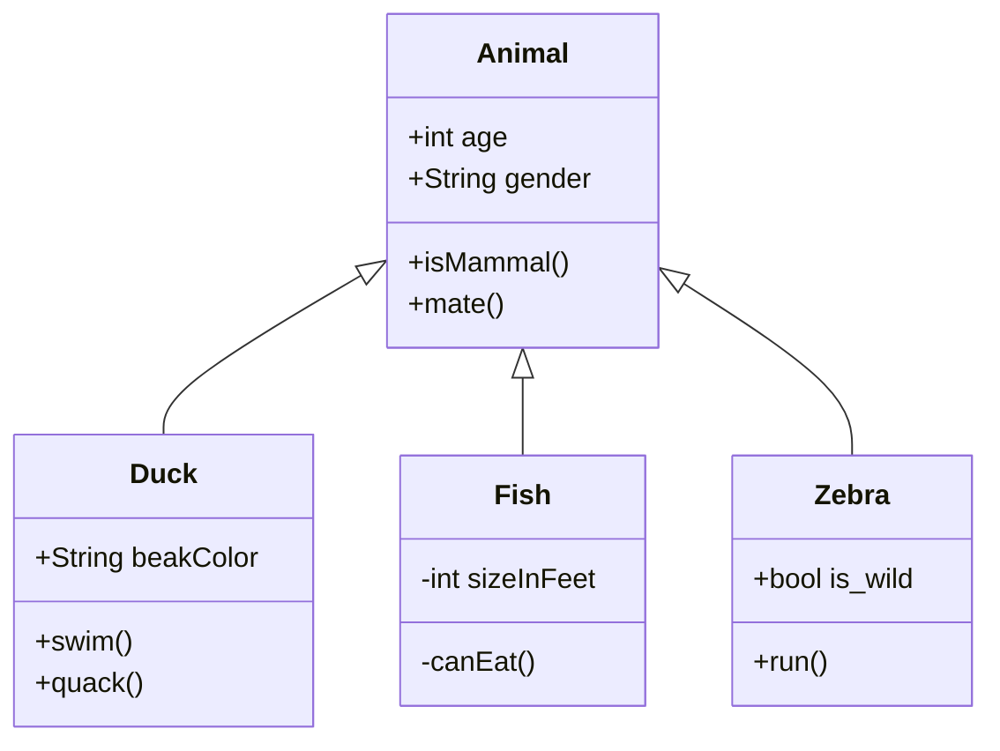

## Preface

Wanting a fast way to learn the insides of Unreal Engine, I inquired the UE dev community regarding resources for a deep dive into Epic Game's Unreal Engine architecture beyond stepping through the source code or reading the little information provided in the official documentation. To my dismay, someone responded there aren't many resources like that around. So
begins my journey to understand the engine, write notes on my findings, and share it.

Although there may not be many resources on unraveling the engine code, there are a plethora of resources that help in
understanding the
engine. [Game Engine Architecture by Jason Gregory](https://www.goodreads.com/book/show/6709076-game-engine-architecture)
is a great resource on understanding Unreal Engine, and game engines in general.

## Runtime Engine Architecture

Unreal Engine, like all software systems and game engines, is built in layers. In order to
maintain modularity and avoid circular dependencies, the lower layers do not depend on
upper layers.

The upper-most layers contain game runtime classes including `PlayerController` and
`GameModeBase`.



## Entry Point

The entry point for the engine depends on the platform. Every Windows program has an entry-point function called `WinMain`. 
Unreal Engine's entry point for Windows, like all other game engines, is the `WinMain` function defined in `Windows/LaunchWindows.cpp`.
The [Quake 2 engine](https://github.com/id-Software/Quake-2/blob/master/win32/sys_win.c#L594), for example, also has the
identically named function.

Each supported platform has their respective entry point:
* MacOS: `INT32_MAIN_INT32_ARGC_TCHAR_ARGV` in `Mac/LaunchMac.cpp`
* Linux: `int main` in `Linux/LaunchLinux.cpp`
* IOS: `int main` in `IOS/LaunchIOS.cpp`

```cpp
// Windows specific parameters: HINSTANCE is identification to prevent class name clashing
int32 WINAPI WinMain(_In_ HINSTANCE hInInstance, _In_opt_ HINSTANCE hPrevInstance, _In_ char* pCmdLine, _In_ int32 nCmdShow)
{
	int32 Result = LaunchWindowsStartup(hInInstance, hPrevInstance, pCmdLine, nCmdShow, nullptr); // Launch Unreal Engine
	LaunchWindowsShutdown(); 
	return Result; // 0 on success, error level otherwise
}
```

## Main Engine Loop

It is a very simple while loop.

```cpp
while( !IsEngineExitRequested() )
{
    EngineTick();
}
```

## Blueprint

All the graph editor tools are behind the scenes a `UEdGraph`. This includes Blueprint, Material, and Animation graphs.
The `UEdGraph` is a simple graph data structure that listeners on every node.

The all the graphs for a Blueprint, such as the Event Graph, are combined into an Ubergraph.

## Visual Effects

## Resource Manager

Unreal Engine's highly centralized resource manager is a unified interface to access all types of game assets. This includes `umap` and
`uasset` files.